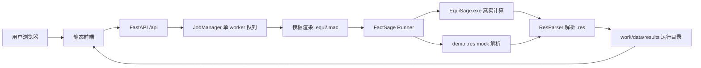
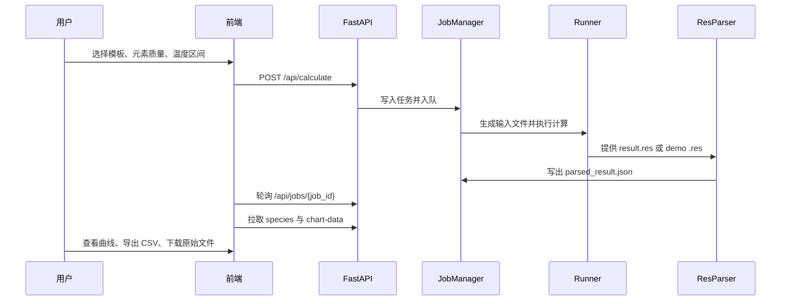

# FactSage 夹杂物/析出相计算与可视化系统

## 项目目标

本项目是 FactSage Equilib 的本地 Web 包装层，用于把夹杂物/析出相温度扫描流程标准化、自动化和可视化。

系统负责：

- 维护钢种模板和元素质量输入。
- 生成 FactSage 可执行的 `.equi` 与 `.mac` 文件。
- 调用本机 FactSage `EquiSage.exe` 或在 mock 模式下解析 demo `.res`。
- 解析结果并提供曲线展示、CSV 导出和原始文件下载。

系统不负责：

- 替代 FactSage 热力学计算引擎。
- 内置或再分发商业 FactSage 软件与数据库。
- 保证 mock 结果具有真实热力学预测意义。

## 开发环境

- Windows
- Python 3.10+
- FastAPI、Uvicorn、Pydantic v2、SQLite
- PyInstaller onedir 打包
- 前端为静态 `HTML + CSS + vanilla JS`
- 图表依赖本地 `frontend/vendor/echarts.min.js`

推荐使用项目虚拟环境：

```powershell
.venv\Scripts\python.exe -m pip install -r backend\requirements.txt
```

## 运行方式

开发模式：

```powershell
.venv\Scripts\python.exe run.py
```

访问：

```text
http://127.0.0.1:10688/
```

强制 mock 模式：

```powershell
$env:MOCK_MODE='true'
.venv\Scripts\python.exe run.py
```

## exe 发布方式

打包命令：

```powershell
.venv\Scripts\python.exe build.py
```

产物目录：

```text
dist/FactSage_InclPrecip/
```

可交付压缩包：

```text
dist/FactSage_InclPrecip.zip
```

运行入口：

```text
dist/FactSage_InclPrecip/FactSage_InclPrecip.exe
```

交付时必须复制或解压整个 `FactSage_InclPrecip` 目录，不要只复制 exe。目录内的 `config.json`、`templates/`、`frontend/`、`demo/`、`data/`、`work/`、`results/` 都是运行所需内容。

## 配置文件

发行版读取 exe 同级目录的 `config.json`。修改配置后，重启 exe 即可生效。

常用配置：

```json
{
  "server": {
    "host": "127.0.0.1",
    "port": 10688
  },
  "factsage": {
    "dir": "C:\\FactSage",
    "timeout_seconds": 600
  },
  "mock": {
    "enabled": "auto"
  }
}
```

说明：

- `server.host`：监听地址。仅本机使用建议 `127.0.0.1`；局域网访问可改为 `0.0.0.0`，同时需要处理防火墙和网络安全边界。
- `server.port`：监听端口。端口被占用时换一个端口并重启 exe。
- `factsage.dir`：FactSage 安装目录，真实计算时会寻找其中的 `EquiSage.exe`。
- `mock.enabled`：`auto` 表示找不到 FactSage 时自动 mock；也可设为 `true` 或 `false`。

## 总体架构



## 事件流程



## 主要功能

- 模板选择：支持“探索模式”和 `52100 / 100Cr6` 轴承钢模板。
- 输入校验：元素质量、温度范围、压力和重复元素校验在后端执行。
- 任务队列：当前为单 worker FIFO，长任务会阻塞后续任务。
- 结果展示：按 species 最大质量过滤，支持曲线查看和不同数值类型。
- 数据导出：支持 CSV 导出和 `.equi/.mac/.res` 原始文件 zip 下载。
- 离线前端：ECharts 使用本地 vendor 文件，发行包不依赖 CDN。

## 验证命令

测试：

```powershell
.venv\Scripts\python.exe -m pytest backend\tests
```

打包：

```powershell
.venv\Scripts\python.exe build.py
```

发行版烟测建议：

1. 修改 `dist/FactSage_InclPrecip/config.json` 的 `server.port`。
2. 启动 `FactSage_InclPrecip.exe`。
3. 访问对应端口。
4. 提交一次 mock 任务。
5. 确认任务完成、图表显示、CSV 和原始文件下载正常。

## 约束和风险

- 真实计算依赖用户机器已安装 FactSage，发行包不包含 FactSage 本体。
- mock 模式只证明 Web、模板、队列、解析和导出链路可用。
- 修改模板时必须同步维护 `registry.json`、`meta.json` 和 `case.equi.tpl`。
- `.res` 固定宽度解析较脆弱，改解析器必须跑回归测试。
- 不要删除 `demo/Equi2.res` 和 `demo/Equ2222i.res`，mock 与测试依赖它们。
